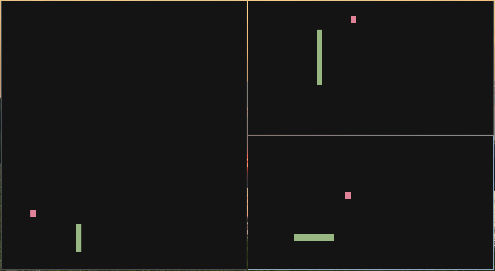

# tui-snake
A simple Snake game written in Rust. I used crossterm library to handle terminal drawing. Game automaticly ajusts to size of your terminal. I recommend using a monospaced font to avoid rendering issues.

## How to run it
1. **Clone the repo:**
```bash
git clone https://github.com/tymonkar/tui-snake.git
cd tui-snake
```
2. **Run it:**
```bash
cargo run
```
## Installation
If you want to run the game as a system command, run this command inside the projet folder:
```bash
cargo install --path .
```
### Controls
- Use arrow keys to to change direction
- Use Q to quit the game
